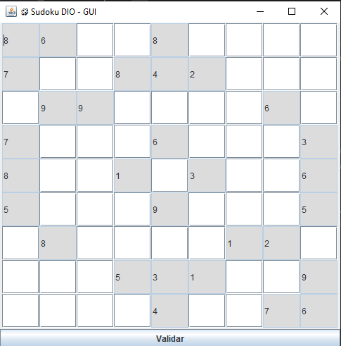
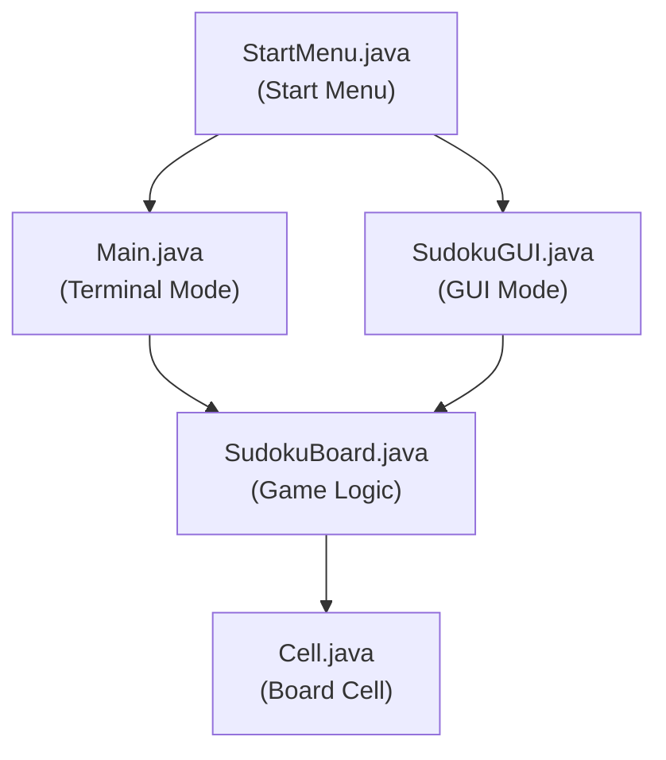
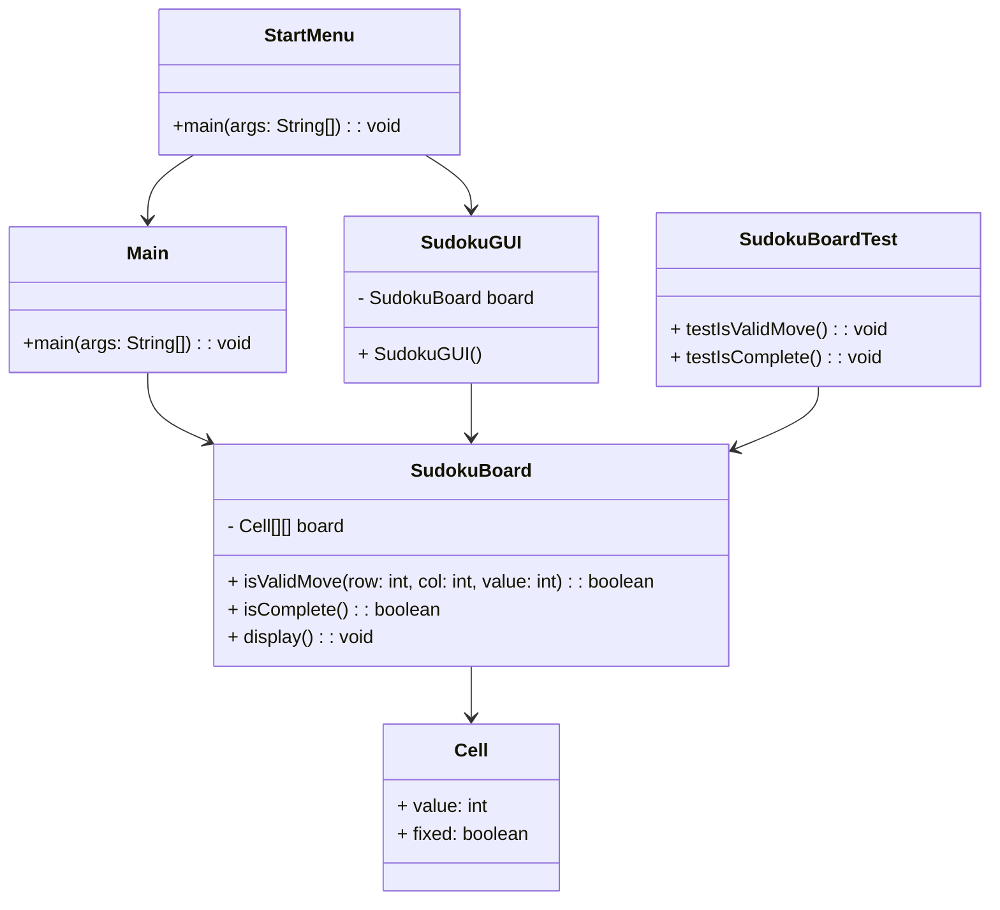

# 🧩 Sudoku Console & GUI Game

[](https://www.oracle.com/java/)
[](https://junit.org/junit5/)
[](https://maven.apache.org/)
[](LICENSE)

A 100% Java Sudoku game that can be played in the terminal or with a graphical interface (Swing GUI). Biggest focus: OOP, clean code, and two execution experiences!

---

## 🖥️ GUI Screenshot

<p align="center">
  
</p>

---

## 📊 Architecture Diagram

Application execution starts with `StartMenu`, giving the user a choice: run in the terminal (`Main`) or with GUI (`SudokuGUI`). Both modes rely on `SudokuBoard` for all game logic and state, which in turn manages the individual `Cell` instances.



---

## 📝 UML Diagram

UML overview: shows relationships and main methods among the core classes—`StartMenu` or `Main` start the game, `SudokuBoard` manages logic, `SudokuGUI` is the graphical view, and `Cell` represents board units. Unit tests validate game logic.



---

## 🌟 Features

- 🎲 Board initialization with random preset values
- 🖥️ Playable by **terminal (console)** or **modern Swing GUI**
- 😎 OOP and clean architecture, easy to extend for new features
- ✅ Move validation: no altering fixed cells, no number repetition on row, column, or 3x3 block
- 🏁 Automatic game-completion verification
- 🧪 Automated tests (JUnit 5)
- 📝 Simple, readable code structure

---

## 📁 Project Structure

```text
src
├── main
│   └── java
│       └── com.dio.sudoku
│           ├── Cell.java           # Board cell: value, fixed/variable
│           ├── Main.java           # Terminal mode entry point
│           ├── StartMenu.java      # Menu for choosing Console or GUI
│           ├── SudokuBoard.java    # Core board logic and validation
│           └── SudokuGUI.java      # Graphical interface (Swing)
├── test
│   └── java
│       └── com.dio.sudoku
│           └── SudokuBoardTest.java  # Unit tests (JUnit)
assets/
└── sudoku-gui.png                   # Screenshot of GUI
```

---

## 🚀 Getting Started

**Prerequisites**
- Java 17 or newer
- Maven 3.8+
- Any IDE (Eclipse, IntelliJ, VS Code) or terminal

**Clone the repo**
```sh
git clone https://github.com/solozabal/dio-bradesco-sudoku-java.git
cd dio-bradesco-sudoku-java
```

### ▶️ Run in Terminal (console mode)

Compile and run directly:
```sh
mvn compile
java -cp target/classes com.dio.sudoku.Main
```

Or, in your IDE, right-click `Main.java` and **Run** as Java app.

### 🖼️ Run Graphical Interface (Swing GUI)

```sh
mvn compile
java -cp target/classes com.dio.sudoku.SudokuGUI
```
Or, in IDE: right-click `SudokuGUI.java` and **Run**.

### 🏁 Universal Start (menu for both modes)
```sh
java -cp target/classes com.dio.sudoku.StartMenu
```

---

## ⌨️ Command Example (Terminal)

When playing in the console, you’ll be prompted:
```sh
Enter your move as: row col value (e.g. 0 1 5)
> 0 1 4
```
This attempts to set 4 in row 0, column 1.

---

## 🏆 Code Highlights

### 1. Game Board & Validation
```java
public class SudokuBoard {
    private Cell[][] board;
    //...
    public boolean isValidMove(int row, int col, int value) {
        // Check row, column, block, and if cell is fixed
    }
}
```

### 2. Console Play Loop

```java
while (!board.isComplete()) {
        board.display();
    System.out.print("Enter move: ");
// Parse move, validate, update board
}
        System.out.println("Congratulations, you solved the puzzle!");
```

### 3. Launching the GUI

```java
public class SudokuGUI extends JFrame {
    public SudokuGUI() {
        // Setup window, create 9x9 grid, bind actions to cells/buttons
    }
}
```

### 4. Automated Tests

```java
@Test
void testIsValidMove() {
    SudokuBoard board = new SudokuBoard();
    assertTrue(board.isValidMove(0, 0, 5));
    assertFalse(board.isValidMove(0, 0, 3)); // If already occupied, etc
}
```

---

## 🧪 Testing

- Tests are in `SudokuBoardTest.java`
- Run with your IDE (right-click: **Run as JUnit Test**) or via terminal:

```sh
mvn test
```

---

## 🤝 Contributing

Contributions are always welcome!  
Feel free to fork, open issues, or submit pull requests.

---

## 📄 License

Licensed under the [MIT License](LICENSE).

---

<p align="center">
  <a href="https://www.linkedin.com/in/pedrosolozabal/">
    
  </a>
</p>